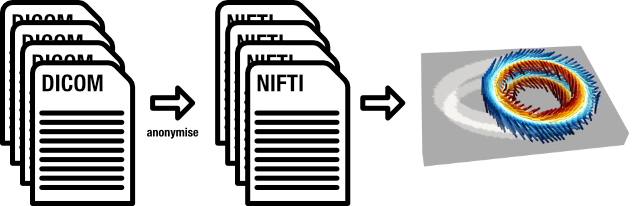

# Exporting anonymised Cardiac Diffusion Tensor data

<p align="center">

</p>

<p align="center">
Anonymisation of cardiac diffusion tensor imaging data.<br>

</p>

This repository contains a Python script designed to anonymise cardiac DTI data, and to convert DICOM data to NIFTI format.

This is going to be the standard procedure to share cardiac DTI data within the
[Cardiac Diffusion Special Interest Group (SCMR)](https://scmr.site-ym.com/group/Diffusion).

This README describes the steps to install and run the Python script.

## Introduction

Cardiac DTI DICOM data should be converted to NIFTI format without any personal information.
A Python script that internally calls the [dcm2niix](https://github.com/rordenlab/dcm2niix) command tool is going to be used for this purpose.
This tool exports:

- NIFTI files which contain the pixel values and minimal metadata information
- b-values
- diffusion directions
- Extra metadata in a JSON file.
- CSV file with adjusted b-values (STEAM sequences only)

>[!NOTE]
> The diffusion direction files given by `dcm2niix` are already rotated to the image plane.

>[!WARNING]
> At the moment we do not support enhanced multi-image DICOMs.

---

## Installation

### dcm2nixx

Install the `dcm2niix` tool. More information on how to install it can be
found in [this link](https://github.com/rordenlab/dcm2niix?tab=readme-ov-file#install).

For macOS with Homebrew you can just run the command: `brew install dcm2niix`.

### Python enviroment

A recent version of Python 3 is needed. This script was developed on Python 3.10 (macOS).

Check this link for [Python installation instructions](https://realpython.com/installing-python/) if you don't have Python 3 installed in your system.

Clone or download this repository, go to the repository folder and create a virtual environment
and install the dependencies. If you have `git` you can use the following terminal commands:

**Get the repository:**

```bash
git clone https://github.com/ImperialCollegeLondon/cdti_data_export.git
cd cdti_data_export
```

**Create the virtual environment and install the dependencies:**

```bash
python -m venv .venv
source .venv/bin/activate
pip install -U pip setuptools wheel pip-tools
pip install -r requirements.txt
```
>[!NOTE]
> Note: you may need to specify `python3` instead of `python` command for some systems.

---

## Running

You will need the full path for the input and output folders.

- `<input_folder>` is the path to the folder where the DICOM files are located.
- `<output_folder>` is the path to the folder where the nii files will be created.

>[!WARNING]
> Make sure you are using the python virtual environment created in the repository folder.
> You can use the following commands to activate it:

```bash
cd <repository_folder>
source .venv/bin/activate
```

>[!NOTE]
> For Philips STEAM data, the scan log file should also be in the `<input_folder>`.

Finally run the following command:

```bash
# for SE data
python cdti_data_export.py <input_folder> <output_folder>

# for STEAM data
python cdti_data_export.py <input_folder> <output_folder> steam
```

### Output

If the scripts runs successfully, the `<output_folder>` should contain one or multiple:

- NIFTI files: `*.nii`
- b-values: `*.bval`
- diffusion directions: `*.bvec`
- Extra metadata: `*.json`
- adjusted b-value tables `*.csv` (STEAM sequences only)

Please double check if no private data is present in the output files, including acquisition date and time.
